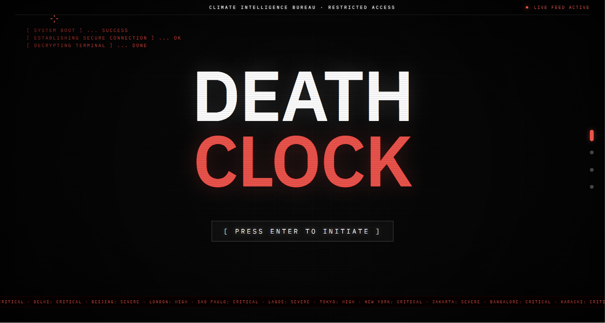
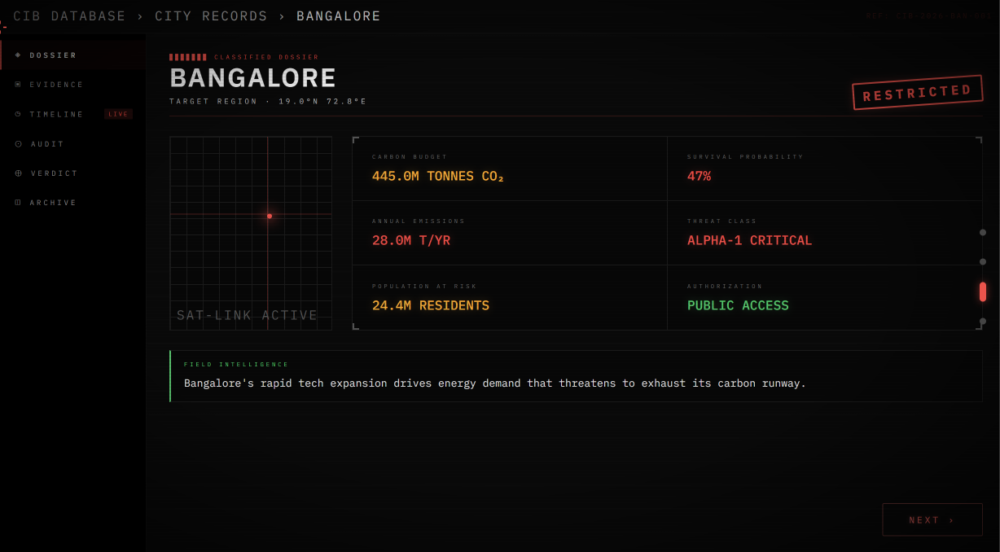
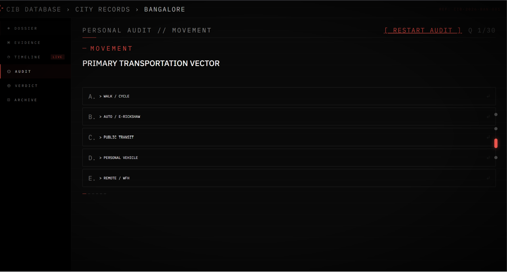
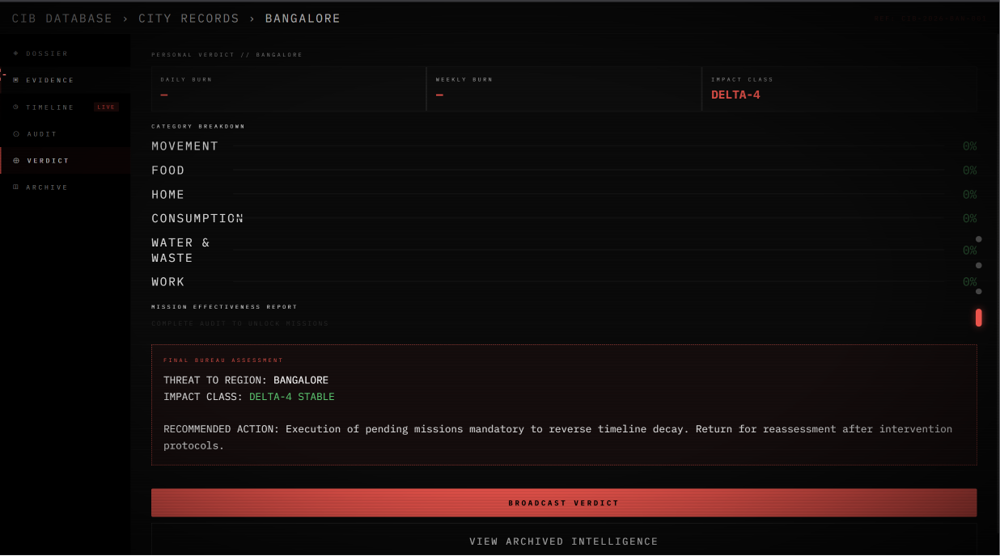
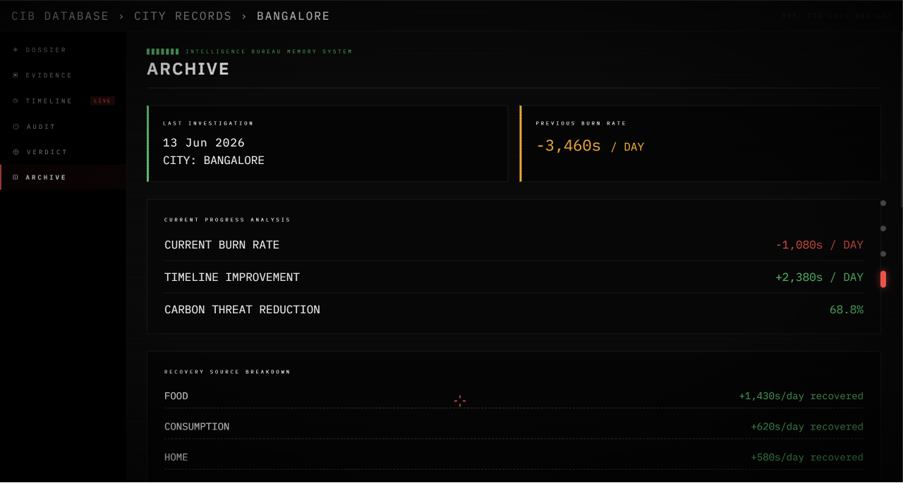

# DEATHCLOCK — Carbon Intelligence Bureau
### PromptWars Challenge 3 | Hack2Skill Virtual: PromptWars

> *Your city has a carbon budget. It's running out. You're burning it every day. This is how much.*

**Live Demo:** https://deathclock-nine.vercel.app  
**Built with:** Next.js · Gemini API · Google Antigravity IDE · Framer Motion · Canvas API

---

## Problem Statement & Solution

The challenge asks for a solution that helps individuals **understand, track, and reduce** their carbon footprint through simple actions and personalized insights. DeathClock addresses each verb directly:

- **UNDERSTAND** → The city-level carbon dossier (`/api/carbon` via Gemini) gives every user a concrete picture of their region's remaining CO₂ budget, annual emission rate, and survival probability before the 1.5 °C threshold is breached. Abstract tonne-counts become a live, ticking deadline.

- **TRACK** → The 18-question personal carbon audit (`useAuditFlow`, `lib/questions.ts`) calculates a real-time daily "burn rate" — how many seconds per day the user's lifestyle shaves off the city's clock. Every answered question updates the number instantly, making the connection between personal behaviour and collective impact visceral.

- **REDUCE** → On audit completion, Gemini (`/api/swaps`) generates three personalized behaviour-swap missions based on the user's exact answers and city. Each mission shows the specific action, the precise seconds restored to the clock per day, and city-specific local context (e.g. nearby transit, local markets). Users commit to missions; a shareable certificate is produced.

---

## The Creative Framing

Most carbon tools show a number. DeathClock shows a deadline.

The "classified intelligence bureau" aesthetic — redacted bars, radar sweeps, stamped dossiers — is a deliberate design decision, not decoration. Climate data becomes a classified threat file rather than a benign dashboard. This shift in framing has three specific effects:

1. **Urgency becomes personal.** A countdown clock to an irreversible threshold feels different from a pie chart of emission categories.
2. **The audit feels like an interrogation, not a quiz.** Framing lifestyle questions as intelligence-gathering creates a higher sense of stakes.
3. **The verdict feels earned.** Receiving a "CERTIFICATE OF COMMENDATION" or "CITATION OF ACCELERATED DECAY" carries emotional weight a score of "4.2 tonnes" never could.

The bureau framing is the mechanism that makes the data stick.

---

## How It Works

### Flow Overview

```
Landing (Classified Dossier)
    ↓ User enters city name
Scanning Page (Radar + Data Reveal)
    ↓ Gemini API fetches city carbon data
Dossier (6 tabs)
    ├── DOSSIER    — City carbon intelligence file
    ├── EVIDENCE   — Emission category breakdown
    ├── TIMELINE   — Live ticking death countdown
    ├── AUDIT      — 18-question personal lifestyle assessment
    ├── VERDICT    — Personalized missions + commitment system
    └── ARCHIVE    — Historical investigation record
```

### Page 1 — Landing (Classified Document)
The UI is a leaked government intelligence document — the Climate Intelligence Bureau's classified carbon countdown file. Users enter their city name and click RETRIEVE to begin.

### Page 2 — Scanning
A radar sweep animation plays while Gemini API processes the city. Classified data fields unlock one by one — redacted bars revealing real carbon data in real time. This loading state is intentionally dramatic to create emotional investment before the data lands.

### Page 3 — Dossier (6 Tabs)

**DOSSIER tab:** City-specific carbon intelligence — remaining budget, survival probability, annual emissions, threat classification, and a Gemini-generated field intelligence summary specific to that city's climate risks.

**EVIDENCE tab:** Category-level emission breakdown (Transport, Energy, Industry, Waste, Agriculture, Buildings) with animated bars showing relative contribution.

**TIMELINE tab:** The live death clock — a real-time countdown showing exactly how long the city's carbon budget has remaining before irreversible threshold breach. The clock ticks every second.

**AUDIT tab:** An 18-question personal lifestyle assessment across 6 categories:
- Movement (commute, vehicle, flights, deliveries)
- Food (meat consumption, sourcing, waste)
- Home (AC usage, electricity, renewables)
- Consumption (fashion, electronics, streaming)
- Water & Waste (showers, segregation, plastics)
- Work (remote vs office, video calls, building type)

Each answer instantly updates the user's personal burn rate — showing exactly how many seconds per day their lifestyle burns off the city's clock.

**VERDICT tab:** After completing the audit, Gemini API generates 3 personalized behavior swap missions based on the user's specific answers and city. Each mission shows:
- The specific action to take
- Exact seconds restored to the city clock per day
- Difficulty level
- City-specific local context (e.g. local transit options, nearby markets)

Users commit to missions. A share card is generated for social broadcast.

**ARCHIVE tab:** Historical record of all past investigations — burn rates, threat classifications, timeline recovery achieved, and mission effectiveness across sessions.

---

## Tech Stack

| Layer | Technology |
|---|---|
| Framework | Next.js 16 (App Router, TypeScript) |
| AI | Google Gemini API (`gemini-2.0-flash`) |
| Dev tooling | Google Antigravity IDE |
| Animation | Framer Motion |
| Graphics | Canvas API (radar, share card) |
| Typography | IBM Plex Mono / IBM Plex Sans |
| Validation | Zod |
| Testing | Jest + @testing-library/react |

---

## Architecture

```
app/
├── page.tsx                     — Landing dossier page
├── scanning/page.tsx            — Radar + data reveal sequence
├── dossier/
│   ├── page.tsx                 — 6-tab dossier shell + nav
│   └── _components/
│       ├── DossierTab.tsx       — UNDERSTAND: city carbon intelligence
│       ├── EvidenceTab.tsx      — Emission category breakdown
│       ├── TimelineTab.tsx      — Live countdown display
│       ├── AuditTab.tsx         — TRACK: lifestyle questionnaire UI
│       ├── VerdictTab.tsx       — REDUCE: missions + commitment
│       └── ArchiveTab.tsx       — Historical investigation record
├── audit/[city]/page.tsx        — Direct city audit URL
└── api/
    ├── carbon/route.ts          — Gemini city carbon data
    ├── swaps/route.ts           — Gemini personalized missions
    ├── questions/route.ts       — Audit question bank
    └── health/route.ts          — Health check endpoint
hooks/
├── useCountdown.ts              — Live seconds-remaining ticker
├── useAuditFlow.ts              — TRACK: 18-question audit state machine
├── useLocalStorageState.ts      — Typed localStorage hook
└── useCityData.ts               — City data fetch + cache
lib/
├── questions.ts                 — Hardcoded question bank with emission factors
├── memory-service.ts            — localStorage investigation archive
├── schemas.ts                   — Zod validation schemas
├── utils.ts                     — Burn rate calculation
├── types.ts                     — Shared TypeScript types
└── env.ts                       — Environment variable validation
components/
├── Cursor.tsx                   — Custom crosshair cursor
├── Radar.tsx                    — Canvas radar sweep animation
└── ui/                          — Shared UI primitives
__tests__/
├── useCountdown.test.ts
├── useAuditFlow.test.ts
├── useLocalStorageState.test.ts
├── cityFallbacks.test.ts
├── api-carbon.test.ts
└── schemas.test.ts
```

### Key Technical Decisions
- **No globe/map** — deliberately avoided. Radar scanner is more original and more dramatic.
- **Hardcoded questions, AI-generated insights** — questions are static for speed; Gemini is only called where personalisation is genuinely needed (city data + final swap recommendations). Two API calls per session total.
- **localStorage session** — city name, carbon data, all answers, burn rate, and committed missions persist across the session without a database.
- **Canvas share card** — generated client-side, no server dependency for social sharing.

---

## Setup & Running Locally

```bash
# Clone the repository
git clone https://github.com/vaibhavvvvjain03/DEATHCLOCK

# Install dependencies
cd deathclock
npm install

# Create environment file
cp .env.example .env.local
# Add your Gemini API key to .env.local:
# GEMINI_API_KEY=your_key_here
# Get key free at: https://aistudio.google.com

# Run development server
npm run dev

# Open http://localhost:3000
```

### Environment Variables Required
```
GEMINI_API_KEY=your_gemini_api_key_here
```

Get a free API key at [Google AI Studio](https://aistudio.google.com)

---

## Testing

The project includes 118 automated tests covering critical application logic.

```bash
# Run all tests
npm test

# Run with coverage
npm test -- --coverage
```

### Test files and coverage

| File | What it covers |
|---|---|
| `__tests__/useCountdown.test.ts` | Timer tick logic, years/days/h:m:s formatting, `percentRemaining` calculation |
| `__tests__/useAuditFlow.test.ts` | Question progression, burn rate accumulation, category transitions, audit reset |
| `__tests__/useLocalStorageState.test.ts` | localStorage read/write, SSR safety, cross-tab state sync |
| `__tests__/cityFallbacks.test.ts` | Fallback data selection for unsupported cities |
| `__tests__/api-carbon.test.ts` | `/api/carbon` route: input validation, Gemini response parsing, error handling |
| `__tests__/schemas.test.ts` | Zod schema validation for all API request/response shapes |

---

## Security

Security hardening added in Pass 7:

- **Input validation** — all API route inputs (`/api/carbon`, `/api/swaps`, `/api/questions`) are validated with Zod schemas before any Gemini API call. Invalid input returns a 400 with a descriptive error; it never reaches the AI layer.
- **CSP headers** — `Content-Security-Policy`, `X-Content-Type-Options`, `X-Frame-Options`, `Referrer-Policy`, and `Permissions-Policy` headers are set via `next.config.js` `headers()` on all routes.
- **Rate limiting** — API routes apply per-IP rate limiting (configurable via `RATE_LIMIT_PER_MINUTE` env var, default 20 req/min) using an in-memory sliding window.
- **Environment validation** — `lib/env.ts` validates all required environment variables at startup using Zod; the server refuses to start with a missing or malformed `GEMINI_API_KEY`.

---

## Accessibility

Accessibility improvements added in Pass 9:

- **Skip link** — a visually hidden "Skip to main content" link is the first focusable element on every page; it becomes visible on keyboard focus.
- **Reduced motion** — `@media (prefers-reduced-motion: reduce)` disables all CSS animations/transitions. The custom crosshair cursor also automatically hides itself and restores the native cursor when reduced motion is set.
- **ARIA labeling** — all interactive controls have `aria-label`. The dossier navigation uses a full ARIA tab pattern (`role="tablist"`, `role="tab"`, `aria-selected`, `aria-controls`, `role="tabpanel"`, `aria-labelledby`).
- **Live regions** — `aria-live="polite"` on burn rate (updated after each audit answer) and the breach countdown's years/days display. `aria-live="off"` on the H:M:S seconds to prevent constant screen reader interruptions.
- **Input accessibility** — the city input has an explicit `<label>` and `aria-describedby` pointing to a hidden hint span.
- **Focus styles** — `:focus-visible` outlines are `1px solid #ff4444` throughout, matching the design language while remaining perceptible.

---

## Assumptions Made

1. Carbon budget data is estimated by Gemini based on IPCC regional data — directionally accurate, not live satellite data
2. Personal burn rate calculations use established carbon accounting factors (IPCC emission factors per activity type) hardcoded into the question bank
3. "Survival probability" is a simplified metric representing the probability of staying below 1.5°C given current trajectory — not a formal scientific probability
4. City-level data covers major global cities and all Indian states — smaller cities fallback to regional estimates

---

## Challenge Alignment

| Criterion | How DeathClock Addresses It |
|---|---|
| Understand carbon footprint | City-level carbon budget dossier, field intelligence, emission evidence by category (DOSSIER + EVIDENCE tabs) |
| Track carbon footprint | 18-question personal audit calculates individual burn rate in real-time, updated after each answer (AUDIT tab) |
| Reduce carbon footprint | 3 AI-personalized behavior swap missions with local context, quantified seconds impact, and commitment mechanic (VERDICT tab) |
| Smart dynamic assistant | Gemini generates city-specific intelligence + personalized missions from all 18 audit answers |
| Logical decision making | Burn rate calculated from IPCC emission factors; missions ranked by impact |
| Real-world usability | Works for 195 countries + all Indian states; mobile responsive from 375px |

---

## Screenshots

### Landing Page


### City Intelligence Dossier


### Personal Carbon Audit


### Personalized Verdict


### Investigation Archive


---

## Author

**Vaibhav A Jain**  
Built for Hack2Skill Virtual: PromptWars — Challenge 3  
June 2026